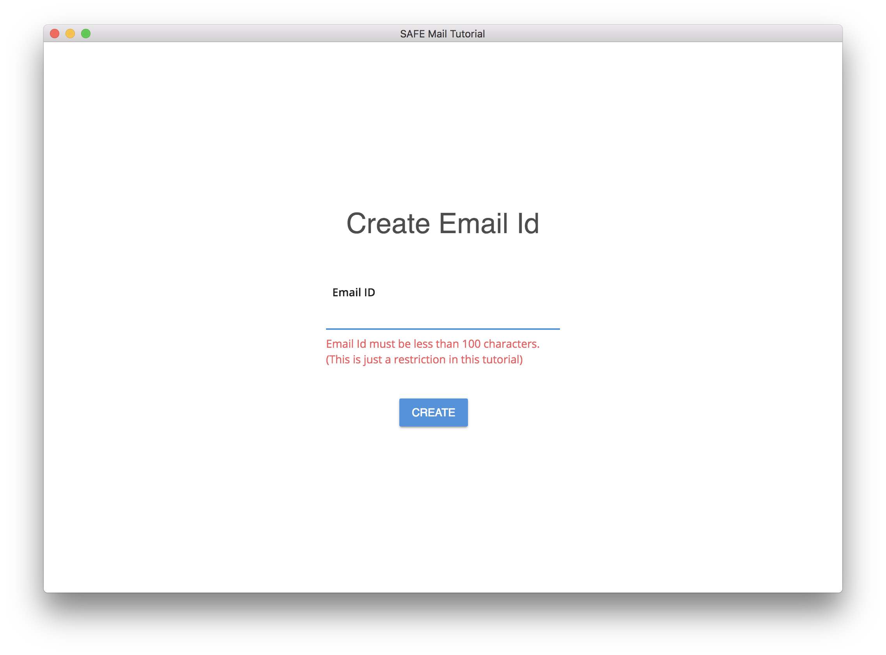
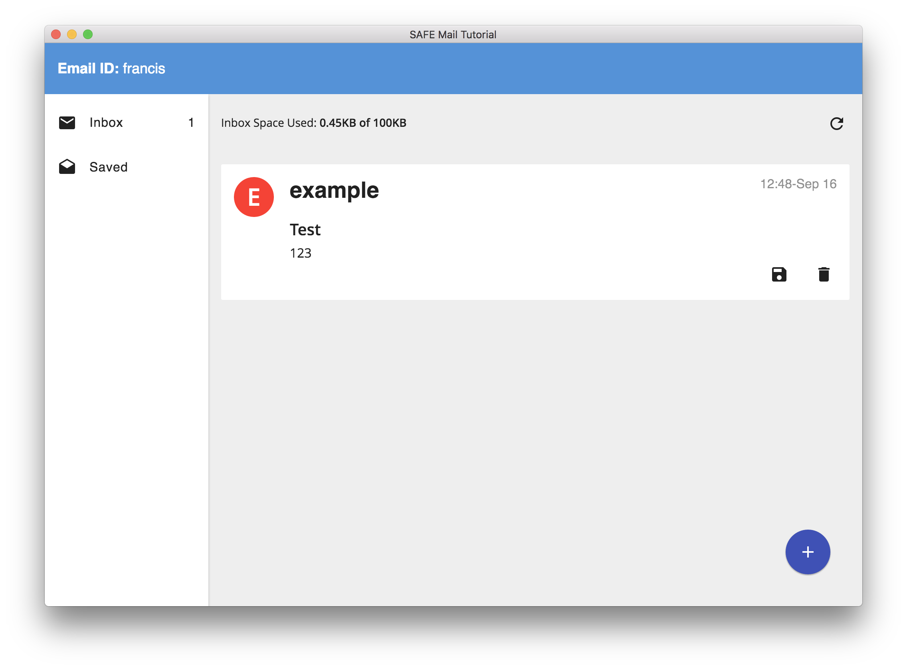

# Create an email ID

The app prompts you to create an email ID (if you hadn't created one yet). An email ID is an identity that you can give to other users in order to receive emails via the SAFE Network. Likewise, to send emails to other SAFE Network users, you need to know their email ID.

#### Contents

<!-- toc -->



> #### info::How is an email ID different from an email address?
>
> An email ID **only works on the SAFE Network**. It's not compatible with traditional email apps such as Gmail. And [existing email addresses](https://en.wikipedia.org/wiki/Email_address) (e.g. *username@example.com*) are not compatible with this app.
>
> Also, since the SAFE Network doesn't use the traditional [Domain Name System](https://en.wikipedia.org/wiki/Domain_Name_System) (the one managed by [ICANN](https://en.wikipedia.org/wiki/ICANN)), the app doesn't need to enforce a specific email format (e.g. username + domain name). Feel free to register any email ID you want.

## Create an appendable data

The app attempts to create a private appendable data with the hash of the email ID you entered. If an appendable data with an ID corresponding to the hash of the email ID you want already exists, you will have to choose another email ID.

This appendable data will be used as your inbox. It has a maximum size of 100 KiB. You can save the emails you want to keep by moving them your root structured data (which has no size limit) and you can delete the emails you don't want to keep by removing them from your appendable data.

Other users will be able to send you emails by appending them to your appendable data. All emails will be encrypted using your public encryption key, therefore only you will be able to read them.

All appendable data items need to have an ID that is 32 bytes long. Therefore, the app generates a 32 bytes long ID by hashing your email ID:

```js
export const hashEmailId = emailId => {
  return crypto.createHash('sha256').update(emailId).digest('base64');
};
```

#### POST [/appendableData](https://github.com/maidsafe/rfcs/blob/master/text/0042-launcher-api-v0.6/api/appendable_data.md#create)

**appendable_data_actions.js**

```js
export const createAppendableData = (token, hashedEmailId) => {
  return {
    type: ACTION_TYPES.CREATE_APPENDABLE_DATA,
    payload: {
      request: {
        method: 'post',
        url: '/appendableData',
        headers: {
          'Authorization': token
        },
        data: {
          id: hashedEmailId,
          isPrivate: true,
          filterType: CONSTANTS.APPENDABLE_DATA_FILTER_TYPE.BLACK_LIST,
          filterKeys: []
        }
      }
    }
  };
};
```

## Update the root structured data

After the appendable data is successfully created, the app saves your email ID in your root structured data. That way, the app will be able to retrieve your appendable data in the future.

#### PUT [/structuredData/:id](https://github.com/maidsafe/rfcs/blob/master/text/0042-launcher-api-v0.6/api/structured_data.md#update-structured-data)

**core_structure_actions.js**

```js
export const updateCoreStructure = (token, id, data) => ({
  type: ACTION_TYPES.UPDATE_CORE_STRUCTURE,
  payload: {
    request: {
      method: 'put',
      url: `/structuredData/${id}`,
      headers: {
        'Content-Type': 'text/plain',
        'Tag-Type': CONSTANTS.TAG_TYPE.DEFAULT,
        Encryption: CONSTANTS.ENCRYPTION.SYMMETRIC,
        'Authorization': token
      },
      data: new Uint8Array(new Buffer(JSON.stringify(data)))
    }
  }
});
```

#### Example

If your email ID is **francis**, the JSON data contained in your root structured data would look like this:

```json
{
  "id": "francis",
  "saved": []
}
```

## Drop the appendable data handle

After the root structured data is successfully updated, the app drops the data identifier handle corresponding to your appendable data.

#### DELETE [/dataId/:handleId](https://github.com/maidsafe/rfcs/blob/master/text/0042-launcher-api-v0.6/api/appendable_data.md#drop-handle)

**data_handle_actions.js**

```js
export const dropHandler = (token, handleId) => ({
  type: ACTION_TYPES.DROP_HANDLER,
  payload: {
    request: {
      method: 'delete',
      url: `/dataId/${handleId}`,
      headers: {
        'Authorization': token
      }
    }
  }
});
```

After the appendable data handle is successfully dropped, the app transitions to the Inbox page.


