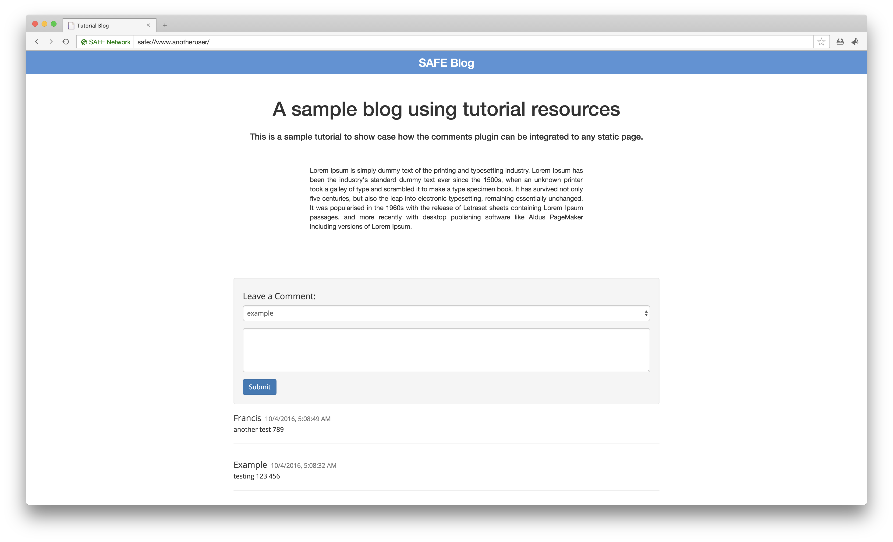

# Website with comments

In this tutorial, you will learn how to **add comments to your SAFE website**!

We built a comments plugin that lets people comment on content using their [public name](https://api.safedev.org/dns/). It can be added to any HTML page. It also enables the website owner to delete comments and block users.

#### Contents

<!-- toc -->



## Overview

This tutorial will showcase how to:

- [Load comments](load-comments.md)
- [Enable comments](enable-comments.md)
- [Add a comment](add-a-comment.md)
- [Delete a comment](delete-a-comment.md)
- [Block a user](block-a-user.md)
- [Unblock a user](unblock-a-user.md)

### APIs

You will learn about the following APIs:

- [Authorization API](https://api.safedev.org/auth/)
- [DNS API](https://api.safedev.org/dns/)
- [Appendable Data API](https://github.com/maidsafe/rfcs/blob/master/text/0042-launcher-api-v0.6/api/appendable_data.md)
- [Structured Data API](https://github.com/maidsafe/rfcs/blob/master/text/0042-launcher-api-v0.6/api/structured_data.md)
- [Data Identifer API](https://github.com/maidsafe/rfcs/blob/master/text/0042-launcher-api-v0.6/api/data_identifier.md)

### User interface

The user interface is built using the following front-end libraries:

- [Bootstrap](https://getbootstrap.com/)
- [jQuery](https://jquery.com/)

## Source code

[Browse **the source code of the Comments Plugin Tutorial** on GitHub](https://github.com/maidsafe/safe_examples/tree/master/comments_plugin).

### Usage instructions

#### Requirements

##### 1. SAFE Launcher

Start [SAFE Launcher v0.9.1](https://github.com/maidsafe/safe_launcher/releases/tag/0.9.1) and log in.

##### 2. SAFE Browser

Start [SAFE Browser v0.2.7](https://forum.safedev.org/t/safe-browser-0-2-11/164).

##### 3. SAFE Demo App

Start [SAFE Demo App v0.6.1](https://github.com/maidsafe/safe_examples/releases/tag/0.8.0).

#### Setup

##### 1. Add the comments plugin and its dependencies to your website

- [bootstrap-v3.3.7.min.css](https://github.com/maidsafe/safe_examples/blob/master/comments_plugin/bootstrap-v3.3.7.min.css)
- [comments-tutorial.css](https://github.com/maidsafe/safe_examples/blob/master/comments_plugin/comments-tutorial.css)
- [jquery-3.1.1.min.js](https://github.com/maidsafe/safe_examples/blob/master/comments_plugin/jquery-3.1.1.min.js)
- [comments-tutorial.js](https://github.com/maidsafe/safe_examples/blob/master/comments_plugin/comments-tutorial.js)

##### 2. Use this code snippet to insert the comments plugin

```html
<script>
  commentsTutorial.loadComments();
</script>
```

By default, the comments plugin will be added to the `#comments` element. It can also be added to
a specific DOM element by passing a selector to the `commentsTutorial.loadComments();` function.

```html
<script>
  commentsTutorial.loadComments('#myComments');
</script>
```

##### 3. Upload your website using SAFE Demo App

Upload your website folder to the **Public folder** of SAFE Demo App and map that folder to a service and a public name (e.g. `blog.example`).

##### 4. Open your website using SAFE Browser

Go to the URL of your website (e.g. `safe://blog.sample`). Select a page where you added the comments plugin and enable the option to allow comments for that page by clicking on the `Enable Comments` button. This button is only visible for the website owner. Once enabled, logged-in users who visit the page should be able to comment. The website owner can delete comments and block users.

### Example

```html
<!DOCTYPE html>
<html lang="en">
<head>
    <meta charset="UTF-8">
    <title>Tutorial Blog</title>
    <link type="text/css" rel="stylesheet" href="./css/bootstrap-v3.3.7.min.css"/>
    <link type="text/css" rel="stylesheet" href="./css/style.css"/>
    <link type="text/css" rel="stylesheet" href="./css/comments-tutorial.css"/>
</head>
<body>
    <header>SAFE Blog</header>
    <div class="container">
        <div class="post">
            <h1 class="title text-center">
                A sample blog using tutorial resources
            </h1>
            <div class="desc text-center">
                This is a sample tutorial to show case how the comments plugin can be
                integrated to any static page.
            </div>
        </div>
        <div id="comments"></div>
    </div>
    <script type="application/javascript" src="./js/jquery-3.1.1.min.js"></script>
    <script type="application/javascript" src="./js/comments-tutorial.js"></script>
    <script>
        commentsTutorial.loadComments();
    </script>
</body>
</html>
```

### Limitations

This plugin has a few limitations:

- You can't edit comments
- `AppendableData` has a size limitation of 100 KiB. New comments can't be added if the appendable data has reached its maximum size.
