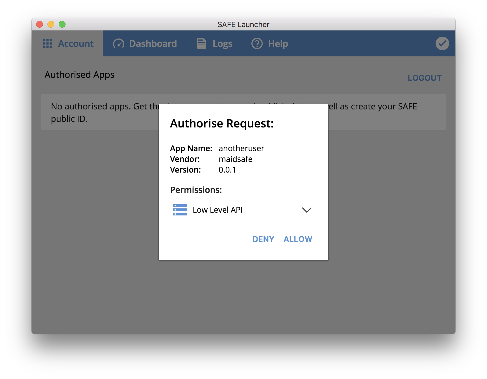

# Authorization

The comments plugin is initialized by the `commentsTutorial.loadComments();` function.

#### Contents

<!-- toc -->

```js
loadComments(destId) {
  if (destId) {
    this.DEST_ELEMENT_ID = destId;
  }
  this.loadInitialTemplate();
  this.toggleSpinner(true);
  this.authToken = this.getAuthToken();
  if (!this.authToken) {
    this.authoriseApp();
  } else {
    this.getDns();
  }
  $(window).on('beforeunload', () => {
    if (this.currentPostHandleId) {
      this.dropAppendableDataHandle(this.currentPostHandleId);
    }
  });
}
```

## Check for an authorization token

First, the plugin checks if an authorization token is stored in the memory of the SAFE Browser.

```js
getAuthToken() {
  return window.safeAuth.getAuthToken(this.LOCAL_STORAGE_TOKEN_KEY);
}
```

A different `LOCAL_STORAGE_TOKEN_KEY` is used for each website (in order to avoid collisions).

```js
this.hostName = window.location.host.replace(/.safenet$/g, '');
this.LOCAL_STORAGE_TOKEN_KEY = `SAFE_TOKEN_${this.hostName}`;
```

#### Example

The value of `LOCAL_STORAGE_TOKEN_KEY` for `safe://blog.example` would be `SAFE_TOKEN_blog.example`.

## If an authorization token is not found

The plugin tries to obtain an authorization token from SAFE Launcher. If you are not logged in, the plugin simply [fetches the comments](load-comments.md) associated with the current page.

### Authorize the plugin

The plugin sends an [authorization request](https://api.safedev.org/auth/) to SAFE Launcher.

#### [POST /auth](https://api.safedev.org/auth/authorize-app.html)

```js
authoriseApp() {
  this.log('Authorising application');
  window.safeAuth.authorise(this.app, this.LOCAL_STORAGE_TOKEN_KEY)
    .then((res) => {
      if (typeof res === 'object') {
        this.setAuthToken(res.__parsedResponseBody__.token);
      }
      this.getDns();
    }, (err) => {
      console.error(err);
      if (this.authToken) {
        this.clearAuthToken();
      }
      this.errorHandler(err);
      return this.fetchComments();
    });
};
```

```window.safeAuth.authorise``` is called using ```this.app``` as an argument:

```js
this.app = {
  name: window.location.host,
  id: 'tutorial.maidsafe.net',
  version: '0.0.1',
  vendor: 'maidsafe',
  permissions: [
    'LOW_LEVEL_API'
  ]
};
```

#### Example

The authorization payload for `blog.example` would look like this:

```json
{
  "app": {
    "name": "blog.example",
    "id": "tutorial.maidsafe.net",
    "version": "0.0.1",
    "vendor": "maidsafe"
  },
  "permissions": ["LOW_LEVEL_API"]
}
```



After you authorize the request, the plugin receives an authorization token and stores it in the memory of the SAFE Browser.

```js
setAuthToken(token) {
  this.authToken = token;
  window.safeAuth.setAuthToken(this.LOCAL_STORAGE_TOKEN_KEY, token);
}
```

The plugin will then [fetch your public names](#fetch-public-name) and add them to the comments UI.

## If an authorization token is found

When you refresh a website that you had already authorized, the plugin retrieves the corresponding authorization token from the memory of the SAFE Browser.

### Fetch your public names

The plugin fetches your [public names](https://api.safedev.org/dns/) and adds them to the comments UI.

#### [GET /dns](https://api.safedev.org/dns/list-long-names.html)

```js
getDns() {
  this.log('Fetching DNS records');
  window.safeDNS.getDns(this.authToken)
    .then((res) => {
      this.user.dns = res.__parsedResponseBody__;
      this.addDnsList();
      if (this.isAdmin()) {
        this.getBlockedUsersStructuredData();
      }
      this.fetchComments();
    }, (err) => {
      console.error(err);
      this.errorHandler(err);
      if (err.message.indexOf('401 Unauthorized') !== -1) {
        return (this.authToken ? this.authoriseApp() : this.fetchComments());
      }
    });
};
```

## Fetch the list of blocked users

If you are the website owner, the plugin tries to fetch the structured data that contains the list of blocked users for the current page. This list contains the public name of each blocked users along with their signing key. Therefore, you can [unblock a user](unblock-a-user.md) based on their public name.

### Fetch the cipher options handle

The plugin fetches a cipher options handle for [symmetric encryption](/email-app/new-concepts.md#symmetric). The structured data that contains the list of blocked users is encrypted using symmetric encryption because it only needs to be accessible by the website owner.

#### [GET /cipher-opts/:encType/:keyHandle?](https://github.com/maidsafe/rfcs/blob/master/text/0042-launcher-api-v0.6/api/cipher_opts.md#get-cipher-opts-handle)

```js
window.safeCipherOpts.getHandle(this.authToken, window.safeCipherOpts.getEncryptionTypes().SYMMETRIC)
```

### Get the data identifier handle for the structured data

The plugin fetches a data identifier handle for the structured data that contains the list of blocked users for the current page.

#### [POST /data-id/structured-data](https://github.com/maidsafe/rfcs/blob/master/text/0042-launcher-api-v0.6/api/data_identifier.md#get-dataidentifier-for-structureddata)

```js
this.symmetricCipherOptsHandle = res.__parsedResponseBody__.handleId;
window.safeDataId.getStructuredDataHandle(this.authToken, this.getLocation() + '_blocked_users', 501)
```

### Get the structured data handle

The plugin fetches a structured data handle using the data identifier handle of the structured data for blocked users.

#### [GET /structured-data/handle/:dataIdHandle](https://github.com/maidsafe/rfcs/blob/master/text/0042-launcher-api-v0.6/api/structured_data.md#get-structured-data-handle)

```js
const dataIdHandle = res.__parsedResponseBody__.handleId;
window.safeStructuredData.getHandle(this.authToken, dataIdHandle)
```

### Drop the data identifier handle

The plugin drops the data identifier handle that represents the structured data for blocked users.

#### [DELETE /data-id/:handleId](https://github.com/maidsafe/rfcs/blob/master/text/0042-launcher-api-v0.6/api/data_identifier.md#drop-handle)

```js
this.dropDataIdHandle(dataIdHandle);
```

### Get the structured data

The plugin fetches the content of the structured data (the list of blocked users for the current page) and adds it to its internal list of blocked users.

#### [GET /structured-data/:handleId](https://github.com/maidsafe/rfcs/blob/master/text/0042-launcher-api-v0.6/api/structured_data.md#read-data)

```js
this.blockedUserStructureDataHandle = res.__parsedResponseBody__.handleId;
window.safeStructuredData.readData(this.authToken, this.blockedUserStructureDataHandle)
```

```js
this.blockedUsers = JSON.parse(new Buffer(data).toString());
if (Object.keys(this.blockedUsers).length > 0) {
  this.toggleCommentsOptions(true); // enable comments unblock user button
}
```
