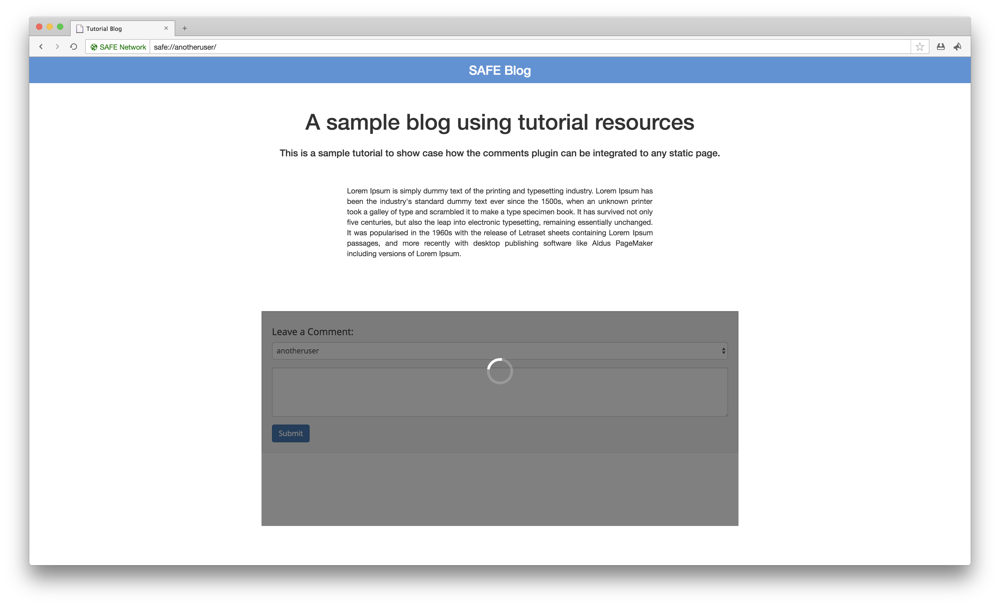

# Load comments

The plugin fetches the comments associated with the current page and adds them to the comments UI.

#### Contents

<!-- toc -->



## Get a data identifier handle

The plugin fetches a data identifier handle for the appendable data associated with the current page.

#### [POST /data-id/appendable-data](https://github.com/maidsafe/rfcs/blob/master/text/0042-launcher-api-v0.6/api/data_identifier.md#get-dataidentifier-for-appendabledata)

```js
this.log('Fetch appendable data data handle id');
window.safeDataId.getAppendableDataHandle(this.authToken, this.getLocation())
  .then((res) => {
    console.log(res);
    fetchAppendableData(res.__parsedResponseBody__.handleId);
  }, (err) => {
    this.errorHandler(err);
    console.error(err);
  });
```

The name of the appendable data is based on the URL of the current page.

```js
getLocation() {
  return `${this.hostName}/${window.location.pathname}`;
}
```

#### Example

```
blog.example//post.html
```

The actual name of the appendable data is the hash of `getLocation()`.

## Get an appendable data handle

The plugin fetches an appendable data handle representing the appendable data associated with the current page.

#### [GET /appendable-data/handle/:dataIdHandle](https://github.com/maidsafe/rfcs/blob/master/text/0042-launcher-api-v0.6/api/appendable_data.md#get-appendabledata-handle-from-dataidentifier-handle)

```js
const fetchAppendableData = (dataHandleId) => {
  this.log('Fetch appendable data');

  window.safeAppendableData.getHandle(this.authToken, dataHandleId)
    .then((res) => {
      this.toggleComments(true);
      this.toggleCommentsInput(!!this.authToken);
      this.currentPostHandleId = res.__parsedResponseBody__.handleId;
      this.dropDataIdHandle(dataHandleId);
      getAppendableDataLength();
    }, (err) => {
      console.error(err);
      this.errorHandler(err);
      if (this.isAdmin()) {
        this.toggleEnableCommentBtn(true);
      }
    });
};
```

### Drop the data identifier handle

The plugin drops the data identifier handle representing the appendable data associated with the current page.

#### [DELETE /data-id/:handleId](https://github.com/maidsafe/rfcs/blob/master/text/0042-launcher-api-v0.6/api/data_identifier.md#drop-handle)

```js
dropDataIdHandle(dataIdHandle) {
  window.safeDataId.dropHandle(this.authToken, dataIdHandle);
}
```

## Get the length of the appendable data

The plugin fetches the metadata of the appendable data. The length of the appendable data represents the number of comments for the current page.

#### [/structured-data/metadata/:handleId](https://github.com/maidsafe/rfcs/blob/master/text/0042-launcher-api-v0.6/api/appendable_data.md#get-metadata)

```js
const getAppendableDataLength = () => {
  this.log('Fetch appendable data length');
  window.safeAppendableData.getMetadata(this.authToken, this.currentPostHandleId)
    .then((res) => {
      this.totalComments = res.__parsedResponseBody__.dataLength;
      insertCommentsOnUI();
    }, (err) => {
      // handle error
      console.error(err);
      this.errorHandler(err);
    });
};
```

## Iterate through the appendable data

If the total number of comments is greater than 0, the plugin iterates through the appendable data. It starts at index 0 and continues until all the comments have been fetched.

```js
const insertCommentsOnUI = () => {
  currentIndex = this.commentList.length % (this.totalComments + 1);
  if (this.totalComments === 0 || (currentIndex === this.totalComments)) {
    addComment();
    return this.toggleSpinner();
  }
  fetchAppendableDataVal(currentIndex);
};
```

### Get a data identifier handle from the appendable data

The plugin fetches a data identifier handle from the appendable data based on the current index.

#### [GET /appendable-data/:handleId/:index](https://github.com/maidsafe/rfcs/blob/master/text/0042-launcher-api-v0.6/api/appendable_data.md#get-data-id-of-a-data-at-appendable-data)

```js
const fetchAppendableDataVal = (index) => {
  this.log('Fetch appendable data value for index :: ' + index);
  window.safeAppendableData.getDataIdAt(this.authToken, this.currentPostHandleId, index)
    .then((res) => {
      return getStructureDataHandle(res.__parsedResponseBody__.handleId);
    }, (err) => {
      console.error(err);
      this.errorHandler(err);
    });
};
```

### Get a structured data handle

The plugin fetches a structured data handle using the data identifier handle of the current comment.

#### [GET /structured-data/handle/:dataIdHandle](https://github.com/maidsafe/rfcs/blob/master/text/0042-launcher-api-v0.6/api/structured_data.md#get-structured-data-handle)

```js
const getStructureDataHandle = (dataHandleId) => {
  window.safeStructuredData.getHandle(this.authToken, dataHandleId)
    .then((res) => {
      this.dropDataIdHandle(dataHandleId);
      getStructureData(res.__parsedResponseBody__.handleId);
    }, (err) => {
      console.error(err);
      this.errorHandler(err);
    });
};
```

#### Drop the data identifier handle

The plugin drops the data identifier handle representing the current comment.

#### [DELETE /data-id/:handleId](https://github.com/maidsafe/rfcs/blob/master/text/0042-launcher-api-v0.6/api/data_identifier.md#drop-handle)

```js
dropDataIdHandle(dataIdHandle) {
  window.safeDataId.dropHandle(this.authToken, dataIdHandle);
}
```

### Get the structured data

The plugin fetches the content of the structured data and adds the comment to the UI. It continues iterating through the appendable data until all the comments it contains have been fetched.

#### [GET /structured-data/:handleId](https://github.com/maidsafe/rfcs/blob/master/text/0042-launcher-api-v0.6/api/structured_data.md#read-data)

```js
const getStructureData = (handleId) => {
  this.log('Fetch structured data');
  console.log('handle id :: ', handleId);
  window.safeStructuredData.readData(this.authToken, handleId)
    .then((data) => {
      const comment = JSON.parse(new Buffer(data).toString());
      this.commentList.unshift({
        index: currentIndex,
        data: comment
      });
      this.dropStructuredDataHandle(handleId);
      insertCommentsOnUI();
    }, (err) => {
      console.error(err);
      this.errorHandler(err);
    });
};
```

#### Drop the structured data handle

The plugin drops the structured data handle representing the current comment.

#### [DELETE /structured-data/handle/:handleId](https://github.com/maidsafe/rfcs/blob/master/text/0042-launcher-api-v0.6/api/structured_data.md#drop-handle)

```js
dropStructuredDataHandle(handleId) {
  window.safeStructuredData.dropHandle(this.authToken, handleId);
}
```
