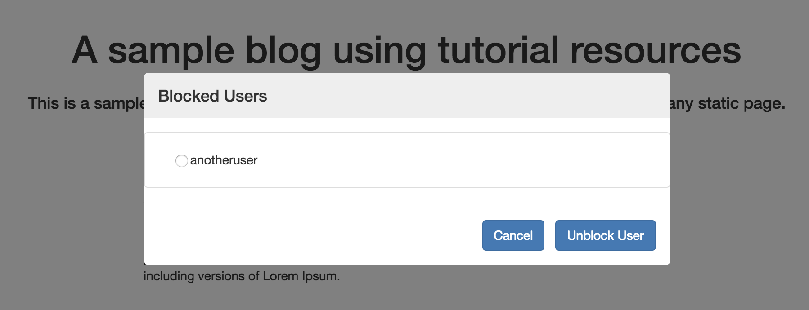

# Unblock a user

If you are the website owner, you can unblock users by removing their signing key from the appendable data associated with the current page.

#### Contents

<!-- toc -->



When you select a user to unblock, the plugin is able to retrieve the serialized signing key of that user from [the list of blocked users](authorization.md#fetch-the-list-of-blocked-users).

## Deserialize the signing key

The plugin deserializes the signing key of the user you want to unblock.

#### POST /sign-key/deserialise

```js
window.safeSignKey.deserialise(this.authToken, new Buffer(this.blockedUsers[userName], 'base64'))
```

The API returns the handle ID for the signing key.

## Remove the signing key from the filter

The plugin removes the signing key of the user you want to unblock from the appendable data associated with the current page.

#### [DELETE /appendable-data/filter/:handleId](https://github.com/maidsafe/rfcs/blob/master/text/0042-launcher-api-v0.6/api/appendable_data.md#delete-sign-keys-from-filter)

```js
const signKeyHandle = res.__parsedResponseBody__.handleId;
window.safeAppendableData.removeFromFilter(this.authToken, this.currentPostHandleId,
  [signKeyHandle])
```

## Update the appendable data

The plugin updates the appendable data associated with the current page by sending a POST request to the SAFE Network.

#### [POST /appendable-data/:handleId](https://github.com/maidsafe/rfcs/blob/master/text/0042-launcher-api-v0.6/api/appendable_data.md#save-appendabledata)

```js
window.safeAppendableData.post(this.authToken, this.currentPostHandleId)
```

## Update the structured data for blocked users

The plugin removes the user you just unblocked from the list of block users for the current page.

#### [PATCH /structured-data/:handleId](https://github.com/maidsafe/rfcs/blob/master/text/0042-launcher-api-v0.6/api/structured_data.md#update-data)

```js
delete this.blockedUsers[userName];
const data = new Buffer(JSON.stringify(this.blockedUsers)).toString('base64');
window.safeStructuredData.updateData(this.authToken, this.blockedUserStructureDataHandle,
  data, this.symmetricCipherOptsHandle)
```

The plugin updates the structured data that contains the list of blocked users for the current page by sending a POST request to the SAFE Network.

#### [POST /structured-data/:handleId](https://github.com/maidsafe/rfcs/blob/master/text/0042-launcher-api-v0.6/api/structured_data.md#save-structured-data)

```js
console.info('Updated data of blocked user Structured Data');
window.safeStructuredData.post(this.authToken, this.blockedUserStructureDataHandle)
```

## Drop the handle for the signing key

The plugin drops the handle that represents the signing key of the user you just unblocked.

#### [DELETE /sign-key/:handleId](https://github.com/maidsafe/rfcs/blob/master/text/0042-launcher-api-v0.6/api/appendable_data.md#drop-sign-key-handle)

```js
window.safeSignKey.dropHandle(this.authToken, signKeyHandle);
alert('User has been unblocked');
this.fetchComments();
```

After the user has been unblocked, the plugin [reloads the comments](load-comments.md).
